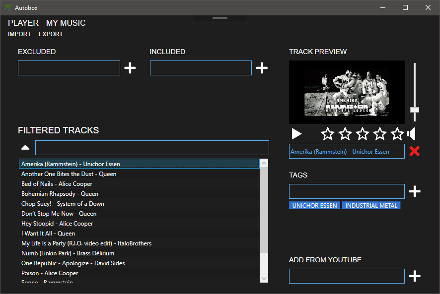
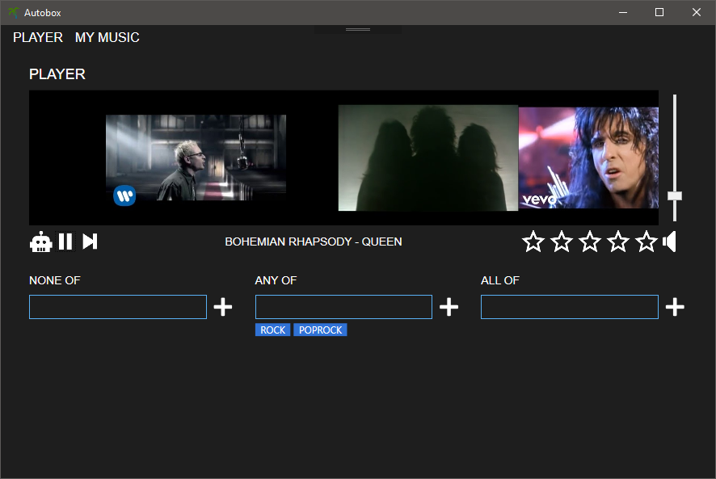

### WIP

## *Autobox* - Automatic Jukebox Player
Autobox project is here to get rid of tedious manual music playlist management.
The main goal is to provide a music library manager, where you can add musics from YouTube links (using [libvideo](https://github.com/i3arnon/libvideo) library) and then add your own custom tags on those music, and to set a custom rating.
Once your library is set, the player will generate a random playlist based on the tags you want!

## Library manager
The library manager allows you to add musics from YouTube links, and to tag them:

## Player
The player will atuomatically generate random playlists according to the tag you asked for:

